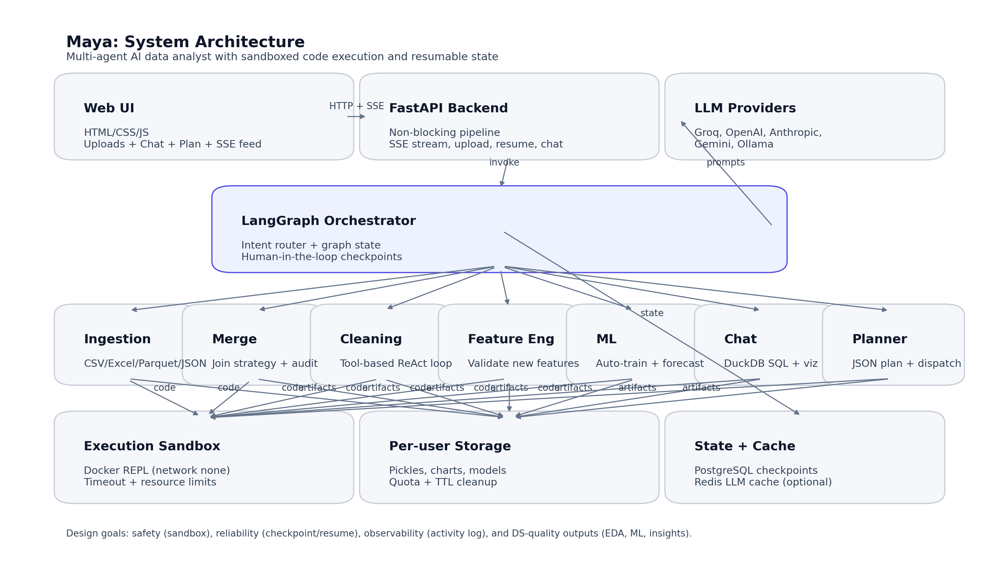

# Maya - AI DATA ANALYST

 

 

 

 

---

Maya is an AI-powered data analyst designed to handle complex multi-file datasets. It automates the entire analytical lifecycle: from ingestion and cleaning to feature engineering and machine learning. Built for reliability, Maya uses sandboxed code execution and provides real-time visibility into its internal operations.

This report details the architecture and design decisions that make Maya a robust system for automated data science.

---

## 
Capabilities

Maya provides a comprehensive suite of features for data analysis:

- **Multi-format Support**: Upload CSV, Excel, Parquet, and JSON files directly.
- **Automated Ingestion**: Standardizes data into an internal format (pickles) for consistent processing across sessions.
- **Intelligent Merging**: Uses LLM-driven join strategies with human-in-the-loop checkpoints to ensure data integrity.
- **Systematic Cleaning**: Employs a ReAct loop to profile and resolve data quality issues while maintaining strict guardrails.
- **Feature Engineering**: Automatically creates and validates new features based on data context.
- **Machine Learning**: An AutoML agent selects models, performs cross-validation, and handles hold-out evaluations.
- **Conversational Analytics**: Transform natural language into DuckDB SQL, generate visualizations, and perform advanced statistical analysis.
- **Workflow Planning**: Generates a structured JSON plan for complex tasks and executes them sequentially after approval.
- **Persistent State**: Uses PostgreSQL-backed LangGraph checkpointing for long-running, resumable pipelines.

> [!NOTE]
> The goal is to provide a complete system — not just a demo — integrating the UI, API, orchestration, and a full test suite.

---

## 
Architecture Overview

> [!IMPORTANT]
> **Design Principles:**
> - **Safety**: All LLM-generated code runs in a Docker sandbox with no network access and strict resource limits.
> - **Reliability**: Pipelines run as background tasks, and state is preserved via checkpoints for resume capability.
> - **Transparency**: A live activity feed provides real-time visibility into agent actions.
> - **Process-Driven**: The workflow mirrors a professional data science process: profiling, cleaning, verifying, and iterating.

---

## 
Runtime Flow

### Pipeline Execution
1. The UI establishes an SSE stream connection before uploading to capture all early events.
2. Files are uploaded via `POST /upload`, including session metadata.
3. The backend stores the files and starts a background LangGraph process.
4. The UI displays real-time updates:
   - Structured logs of agent activity.
   - Progress indicators for each stage.
   - Checkpoints requiring human feedback.
   - Final results or error reports.

### Resuming Work
If a pipeline pauses for feedback or hits a failure, it can be resumed via `POST /resume`. Because the state is checkpointed, it continues exactly where it left off.

---

## 
System Design

### State Management
Maya uses a unified state schema (`MasterState`) in LangGraph that all agents interact with. This state manages:
- **Context**: Message history, user inputs, and feedback.
- **Data**: References to uploaded files and intermediate processing results.
- **Control**: Error tracking, iteration counts, and current status.
- **Output**: Generated charts, ML reports, and analytical insights.

By centralizing the state, the system ensures that agents remain loosely coupled and that the entire pipeline can be checkpointed for persistence.

### Orchestration
The core orchestrator (`core/super_agent.py`) manages task routing using a two-stage approach:
1. **Heuristics**: Fast keyword-based routing for common operations.
2. **LLM Fallback**: Dynamic routing for complex or ambiguous requests.

The graph also tracks the overall workflow, ensuring tasks like table merging happen before cleaning or modeling.

### Reliability and Observability
- **SSE Streams**: Long-running tasks use Server-Sent Events to provide real-time logs and progress updates to the frontend.
- **Checkpointing**: The system supports both PostgreSQL-backed persistence (using `AsyncPostgresSaver`) and in-memory checkpointing. This allows the backend to resume tasks after a restart or failure without losing progress.
- **Sandboxed Execution**: All LLM-generated code runs in a Docker-based sandbox (`core/sandbox.py`) with disabled networking and strict resource limits to ensure host security.
- **Storage Isolation**: User data is isolated in separate directories with enforced quotas (`MAX_USER_STORAGE_MB`) and TTL-based cleanup (`FILE_TTL_HOURS`).
- **Monitoring**: Structured logs are captured for every major action and displayed live in the activity feed. Optional support for Langfuse tracing and Redis-based caching is also included.

---

## 
Specialized Agents

### Ingestion Agent
Handles raw file loading (CSV, Excel, Parquet, JSON) into Pandas. It performs memory optimization (e.g., numeric downcasting) and converts datasets into serialized pickles for faster processing. Specifically, `_smart_read_csv` handles encoding and separator inference.

### Merge Agent
Automatically suggests and executes join strategies when multiple files are present. It focuses on maintaining data integrity by preferring outer joins and performing row-count audits to prevent silent data loss.

### Cleaning Agent
Uses a tool-driven ReAct loop to systematically clean data. It handles:
- Missing value imputation and duplicate removal.
- Outlier detection and category normalization.
- PII scanning and data leakage risk analysis.
- Multi-collinearity and sparsity checks.

Strict guardrails prevent destructive operations, and every change is verified against the original state. The system enforces iteration caps (`MAX_TOOL_TURNS`) to prevent runaway loops.

### Feature Engineering Agent
Identifies and implements new variables to improve model performance. It validates that new features have sufficient variance and provides a human-in-the-loop checkpoint for approval.

### Machine Learning Agent
Supports automated model training and forecasting:
- **Model Selection**: Evaluates XGBoost, LightGBM, Random Forest, and Linear models.
- **Evaluation**: Uses both cross-validation and hold-out sets for robust performance metrics.
- **Artifacts**: Saves trained models, feature importance plots, and metrics to persistent storage.
- **Forecasting**: Dedicated tools for time-series projections and future-date table generation.

### Chat and Analytics Agent
Enables natural language interaction with the data:
- **SQL Generation**: Translates questions into DuckDB SQL with auto-retry logic.
- **Visualizations**: Generates and saves Matplotlib/Seaborn charts.
- **Statistical Testing**: Performs hypothesis tests and interprets results in plain English.
- **Advanced Analytics**: Supports clustering, segmentation, and anomaly detection.

### Planner Agent
Functions as a project manager by creating a structured JSON execution plan for complex requests. It handles task dispatching and coordinates human approval before starting heavy workloads.

---

## 
Frontend Implementation

The interface is built to support real-time agentic interaction:
- **SSE Integration**: UI opens an EventSource connection before uploading to ensure all activity logs are captured.
- **State Rehydration**: Uses `localStorage` and `GET /state/{thread_id}` to restore sessions and UI state.
- **Live Activity Feed**: Renders agent logs and progress updates as they occur.
- **Specialized Views**: Dedicated tabs for data statistics, execution plans, and model performance (metrics and feature importance).
- **Dynamic Assets**: Serves generated charts directly from sandboxed storage.

---

## 
Tools and Technology Stack

### Backend / AI Orchestration

- Python 3.11 (Docker) / Python 3.10 (local venv present)
- FastAPI, Uvicorn
- LangChain + LangGraph (multi-agent state machine and checkpointing)
- Multi-provider LLM support via LangChain integrations:
  - Groq, OpenAI, Anthropic, Google Gemini, Ollama
- PostgreSQL (LangGraph checkpoints)
- Redis (optional LLM response caching)
- Optional Langfuse (observability / traces)

### Data / ML / Stats

- pandas, numpy
- DuckDB (SQL over in-memory DataFrames)
- scipy (hypothesis tests)
- scikit-learn (modeling + CV + metrics)
- xgboost, lightgbm (optional depending on environment)
- imbalanced-learn (imbalance tooling)

### Visualization

- matplotlib, seaborn
- plotly + kaleido (static export support)

### DevOps / Security

- Docker, Docker Compose
- Docker-based sandbox image for executing LLM-written code:
  - `--network none`, resource limits, timeouts

### Testing

- pytest-based unit tests (core modules, graphs compile, tools)
- integration test script for end-to-end API + SSE behavior

---

## 
Project Standards and Challenges

### Technical Challenges
- **Code Generation Reliability**: Managed via tool schemas (ReAct), iteration limits, and auto-retry logic for SQL and charting.
- **Execution Safety**: Addressed by the Docker sandbox, network isolation, and a code-safety gate that blocks high-risk Python primitives.
- **UI Responsiveness**: Enabled through background task processing and SSE-based status streaming.
- **Persistence**: Managed by PostgreSQL-backed checkpointing, allowing recovery from crashes or restarts.

### Data Science Alignment
Maya is designed to follow standard data science best practices:
- **Consistent Profiling**: Every agent starts with a schema and data distribution audit.
- **Data Quality**: Cleaning rules are non-destructive (imputation over removal).
- **Modeling Rigor**: Includes class imbalance analysis, scale recommendations, and leak detection.
- **Evaluation**: Uses both cross-validation and independent hold-out sets for model validation.

---

## 
Verification and Roadmap

### Testing
- **Unit Tests**: Cover core storage, sandbox, and state modules (`tests/test_maya.py`).
- **Integration Tests**: Validate the end-to-end API, SSE behavior, and state persistence (`tests/api_integration_test.py`).

### Security and Infrastructure
- **Sandboxing**: Generated code is isolated from the host via Docker.
- **Secrets**: Environment variables manage API keys; `.env` should be excluded from version control in production settings.

### Known Limitations and Future Work
- **Authentication**: Current session management relies on local storage; future versions will include full user identity and auth providers.
- **Enhanced Sandboxing**: Plans for seccomp/AppArmor profiles and stricter filesystem mounts.
- **Policy Engine**: Implementing a more robust policy engine for custom analysis paths.
- **Data Lineage**: Adding dataset versioning and history (data -> features -> model).
- **Model Registry**: Formalizing metadata, training hashes, and reproducibility.

### Demo Guide
1. Start services with Docker Compose.
2. Upload multiple datasets (e.g., CSVs).
3. Request a full pipeline via natural language: *"Clean the data and train a churn model."*
4. Monitor the activity feed and plan tab.
5. Review results in the Model and Data tabs.
6. Use the chat to ask follow-up questions or generate charts.

---

## 
Technical Reference

### Backend Stack
- **Languages**: Python 3.11
- **Frameworks**: FastAPI, Uvicorn
- **Orchestration**: LangGraph, LangChain
- **Storage/Cache**: PostgreSQL, Redis
- **Data**: DuckDB, Pandas, NumPy, Scikit-learn, XGBoost, SciPy

### Configuration
Environmental variables (listed in `.env.example`) control LLM providers, database strings, and sandbox limits (such as `SANDBOX_TIMEOUT_SECS` and `MAX_FILES_PER_REQUEST`).

---

<b>Appendix A) API Surface (Backend Endpoints)</b>

Primary endpoints implemented in `app/main.py`:

- `POST /upload` — Upload files and start pipeline as a background task.
- `GET /stream/{thread_id}` — SSE stream of live activity and final result.
- `POST /resume` — Resume a paused pipeline with user feedback.
- `POST /chat` — Conversational query execution (synchronous, short path).
- `POST /plan` — Run planner flow in background (requires data already loaded).
- `GET /state/{thread_id}` — Fetch checkpointed state (used for UI restore).
- `GET /statistics?user_id=...` — Column-level stats + sample rows for loaded datasets.
- `GET /download?user_id=...&filename=...` — Export a dataset to CSV.
- `GET /download-forecast?user_id=...` — Download forecast CSV produced by ML agent.
- `GET /chart/{user_id}/{filename}` — Serve chart images.
- `GET /model-report?user_id=...` — Read latest trained model artifact and return metrics/importance.
- `DELETE /reset?user_id=...` — Delete all user data and cancel tasks.
- `GET /health` — Health probe including checkpointer type and running task count.

<b>Appendix B) Repository Map (What Lives Where)</b>

- `app/`
  - FastAPI server, SSE, background execution, checkpoint wiring
- `core/`
  - `state.py` — shared state contract
  - `super_agent.py` — orchestrator graph + intent router
  - `llm.py` — provider factory (Groq/OpenAI/Anthropic/Gemini/Ollama)
  - `sandbox.py` — docker-based secure execution
  - `storage.py` — per-user isolation + quota + cleanup
  - `activity_log.py` — structured log entries for UI
- `agents/`
  - `ingestion/` — file loaders + optimization + optional transformations
  - `merging/` — join planning + sandbox merge execution + audits
  - `preprocessing/` — cleaning ReAct tools + safe transformations + verification
  - `feature_engineering/` — FE ReAct loop + validation
  - `ml/` — AutoML + forecasting + custom ML scripts
  - `chat/` — DuckDB SQL + visualizations + analytics + stats + insights
  - `planning/` — task plan creation + approval + dispatch
- `frontend/`
  - single-page UI (EventSource SSE, file upload, state restore, plan/model render)
- `tests/`
  - unit tests and an end-to-end integration script
- `Dockerfile` and `docker-compose.yml`
  - deployment and local orchestration

<b>Appendix C) Configuration Knobs (Operational Controls)</b>

The system is primarily configured via environment variables:

- `LLM_PROVIDER` and provider-specific API keys/model names.
- `DATABASE_URL` (Postgres checkpointing).
- `REDIS_URL` (optional caching).
- `STORAGE_BASE`, `MAX_USER_STORAGE_MB`, `FILE_TTL_HOURS` (data lifecycle controls).
- `MAX_FILES_PER_REQUEST` (upload safety).
- `SANDBOX_IMAGE`, `SANDBOX_TIMEOUT_SECS`, `SANDBOX_MEM_LIMIT`, `SANDBOX_LOCAL` (execution controls).
- `AUTO_APPROVE` (bypass HITL for test/CI).
- `ALLOWED_ORIGINS` (CORS policy).

